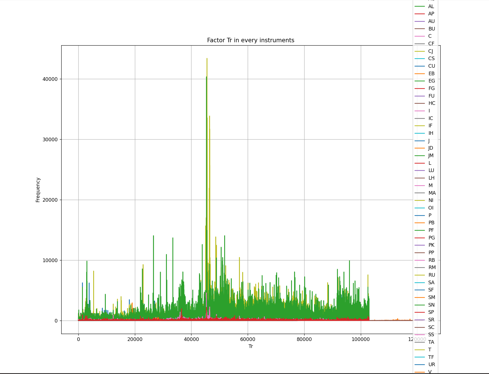
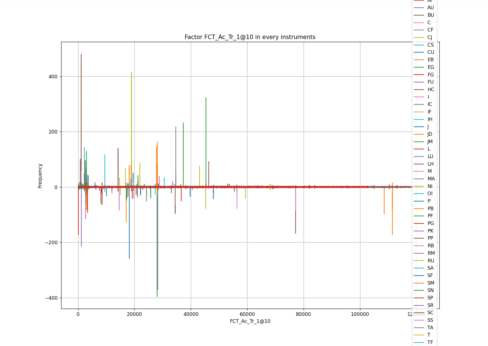

# Welcome

这里是李亦凡的分支。用于分享、存储李亦凡的代码。

## lee.md文档说明

该md文档用于说明我的分支中的各个内容，记录我在每个任务中的**结果**、**问题**与**反思**。

## LEEyf分支说明

文件的存储、以及代码相应的规范要求，参考小组的任务要求。

为了避免数据集的传入，同时尽量减少对公共仓库的更改，我在本地设置了两个工作区，一个用于传输github文件，另一个完全镜像，用于我个人的代码编写与数据计算。

### .vscode文件夹

内部是settings.json文件，主要是工作区环境设置。同时在工作区内添加了部分词语的字典，避免系统拼写查错。

### factor_cal文件夹

因子计算文件，内部包括几个因子的.py计算文件，并通过类的封装全部集成在**factor_cal.py**，供程序调用。

### graphic

- graphic.py：图像绘制文件，利用计算得到的数据绘制图表。
- merge.py：因子合并文件，用于将不同期货类型中的同种因子合并在一个csv文件下。

### data(仅本地)

保存计算相关的数据。

- 5m：存储5分钟线的数据
- merge：存储不同期货品种的相同因子的合并数据集。
- mindiff：存储每个期货品种的最小变动单位。

## 更新日志

### 2025-4-10：期货数据集的搭建与因子计算

#### 2025-4-14

- 尝试通过ricequant下载数据集，但由于相关问题，我本地的数据集构建并没有成功。
- 后面处理所用的数据集都是直接利用子栩学长提供的数据包进行操作的。

#### 2025-4-15

- **基础学习内容**：学习了python中的类、类的封装等概念，并完善了字典等数据类型的理解。
- **进阶学习内容**：学习了pandas中对于数据处理的相关函数，包括：对csv文件的操作，滑动平均计算等内容。
- **任务处理成果**：按照量化小组的任务文档，成功实现了六个因子的计算，并成功在main.py文件下跑通了整个程序。所有的期货类型都实现了处理，程序处理总时间为20分钟左右，总数据文件大小为4Gb。
- **本周任务小结**:对数据处理有了初步地了解，但是由于学习跳跃程度较大，仍有很多内容无法完全掌握，后期需要继续补足。
- **存在的问题**：在所给的数据包中，没有找到mindiff(期货品种的最小变动单位)这个变量，因此，相关的函数直接输出结果，而没有进行相应的判断。正确的函数参考注释部分。
- 学习内容来源主要参考B站上的python学习视频，同时利用了copilot和豆包这两个ai进行程序设计上的辅助。

#### 2025-4-16

- **修改内容**：调整了Tr因子的计算方法，删除了内部冗余的计算步骤，简化算法、
- 补充了相关的注释，使程序的可读性更强。
- 同时完成因子数据分布图的绘制

#### 2025-4-18  **Task_1_1.0.1**

- **增加内容1**：增加了graphic文件夹用于绘制因子相关图像。但是目前只做了一个函数，还没有像factor_cal文件那样利用类对这些函数进行封装。
- **增加内容2**：增加了image文件夹，用于存储相关图像。

相关图像如下

#### 2025-4-19  **Task_1_1.0.2**

- **增加内容1**：在graphic文件夹下增加了merge.py文件，用于将在不同期货类型中的同种因子合并在一个csv文件下面。
- **增加内容2**：为了存储这个合并的csv文件，在data文件夹下，新增了一个./merge/5m/路径，用于存储合并后的csv文件，得到的csv文件命名为{factor}@{length}.csv。
- 最后利用graphic绘制图像
- **后续工作**：目前的merge和graphic文件都没有利用循环对所有因子、所有长度进行计算，如有需要，下一步工作将把这个函数封装为一个类，并将所有因子的图像绘制出来。

#### 2025-4-23  **Task_1_1.0.3**

周常会议之后，根据子栩学长建议做出了优化。

- **因子计算器的优化**：在先前的计算器中，计算出来的因子名称为"{factor}"而不包含任何滑动长度的信息。这次更新将得到的结果改为正确的"{factor}@{length}"的形式。
- **传参的优化**：在先前的factor_calculator程序将带有length和不带length的因子计算分开处理，导致代码十分冗长。这次更新，优化了字典的传参，利用param传入length，以实现factor.formula(param)传参的统一，两种情况的重复代码也归并为同一种，仅保留因文件命名不同导致不同的代码部分。
- **后续工作**：现有的代码仍然没有考虑mindiff的问题，这次会议之后下载了mindiff的数据包，但是来不及对相关代码进行修改。后续将针对这一部分进行处理。

#### 2025-5-1 Task_1_1.0.4

根据之前存在的问题进行了相应的改动

- **加入mindiff参数**：根据之前会议的讨论结果，在这次的更新中，更新了关于mindiff（最小变动单位）的读入、比较与使用。进而完善了因子计算器，得到的结果也更加完整。具体的调用流程为：在 main 中读取 mindiff.csv 文件、设置字典、因子计算器计算。

- **优化计算器**：在先前的计算器中，每次都要重新计算一次滑动平均，大大增加了计算量。在此次更新中，通过修改计算逻辑，减少了相关的计算量。同时，修改了存储的时间格式，改为存储datetime

- `\# 计算 TR 的滚动均值并处理 NaN`

  ​    `rolling_mean_tr = df['Tr'].rolling(window=length).mean().fillna(0)`

  ​    `\# 计算收盘价的滚动均值`

  ​    `rolling_mean_close = df['close'].rolling(window=length).mean().fillna(0)`

  ​    `\# 打印调试信息`

  ​    `print(f"rolling_mean_tr: {rolling_mean_tr}")`

  ​    `print(f"rolling_mean_close: {rolling_mean_close}")`

  ​    `\# 使用 numpy.where 进行分类处理`

  ​    `df[f'FCT_Bias_1@{length}'] = numpy.where(`

  ​      `rolling_mean_tr < mindiff,`

  ​      `0,`

  ​      `(df['close'] - rolling_mean_close) / rolling_mean_tr`

  ​    `)`

- 优化了 main.py 中的循环逻辑，简化了循环代码段，并利用判断语句，为循环提供出口，减少程序的计算量

- 增加各处的报错信息，便于差错
